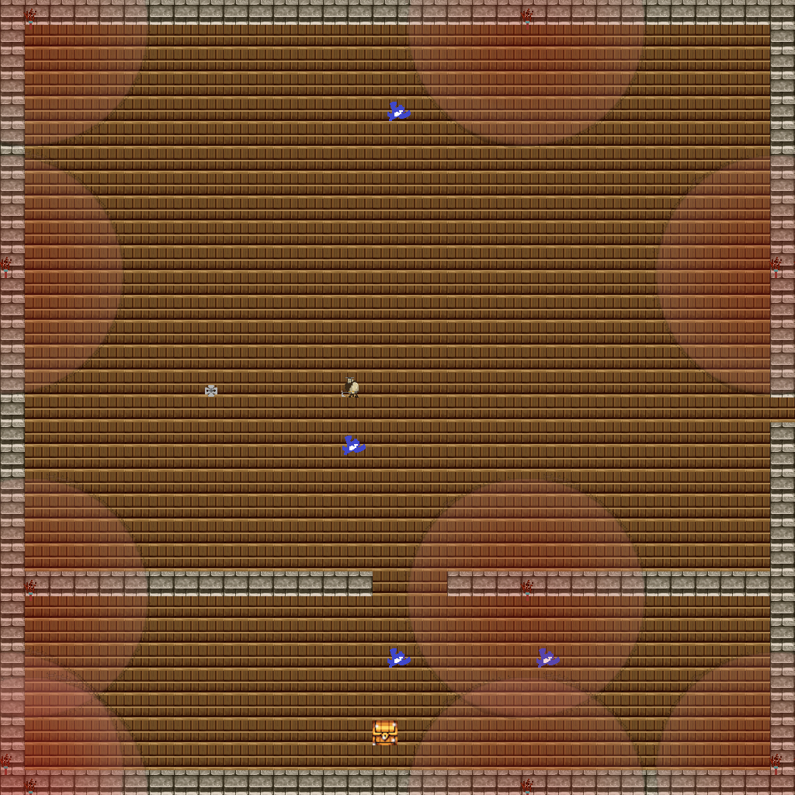

Run
===
	sudo apt install cmake  
	sudo apt install libglfw3-dev  
	cmake .  
	make  
	./bin/main
	
Control options
================
W, A, S, D -move
f12: screenshot  
arrows: range attack  
left/right ctrl: melee attack  
ESC: close window  

Features
========

* tiles of abyss. Player dies if falls
* loose & win screens
* more than 20 rooms; 10 different types
* short impassable walls which do not restrict char's field of view or movement of flying enemies 
* enemies, that patrol their own area(treasure if it is a treasure room) and attacking player if comes close enough 
* final boss with 2 unique mechanics:  
	* throws fireballs  
	* after death spawns an aggressive melee-attacking copy of himself and a pacifist copy  
* animated torches which illuminates (changes color) the hero and enemies / environment  
* animated treasure that gives 200 points(with notification) to the final score on win-screen  
  
**character:**  
* when idle char scanning region turning body left-right  
* in rush moves legs and stretches 1px up-down to show run shaking  and breathing   
* melee attack (right, left, swipe) with simple animation  
* range attack (throwing axes)  

plan.txt
--------
A: big, all-doors room  
a: 'A', but it's a starting point with no enemies
B: long narrow vertical passage  
C: long narrow horizontal passage  
U, D, L, R: upper,lower(down), left or right dead-end room  
S: secret room,  no entrance, 1 exit  
Q: quit room, boss/end of the game room  
	
